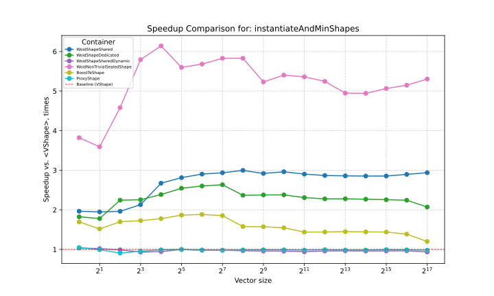

# Woid

**Step into the woid.**

`woid` is a high-performance single-header-only C++ library for **type erasure** and **non-intrusive polymorphism**.

## Key features
- Value semantics
- Duck typing
- Extreme customizability
- Performance

In this benchmark we instantiate a bunch of geometric shapes and get the min-area. Woid is up to 3x faster than inheritance and virtual functions (`VShape`), up to 3x faster than [`microsoft/proxy`](https://github.com/microsoft/proxy) (`ProxyShape`, it fails SBO for non-trivial types) and up to 2x faster than [`boost::te`](https://github.com/boost-ext/te) (`BoostTeShape`). Woid wins even harder if we assume the set of polymorphic types is _sealed_ (`WoidNonTrivialSealedShape`).

See the [Benchmarking](#benchmarking) section for more details.

## Components

| Component | Better version of... |
| :--- | :--- |
| `woid::Any` and friends | `std::any` |
| `woid::Fun` / `woid::FunRef` | `std::function` |
| `woid::InterfaceBuilder` | `virtual` functions and inheritance |


##  Usage Example: Non-Intrusive Interfaces
```cpp
#include <woid.hpp> // Requires C++23, tested with Clang 21 and GCC 15

struct Circle {
    double radius;
    double area() const { return std::numbers::pi * radius * radius; }
};
struct Square {
    double side;
    double area() const { return side * side; }
};
struct Shape : woid::InterfaceBuilder
           ::Fun<"area", [](const auto& obj) -> double { return obj.area(); } >
           ::Build {
    auto area() const { return call<"area">(); }
};

void printArea(const Shape& s) {
    std::println("Area {}", s.area());
}

printArea(Shape{Circle{1.5}});
printArea(Shape{Square{1.5}});
```

## Getting it

```bash
git clone https://github.com/akopich/woid.git
```
`woid` is header-only. So just move the only header file the library consists of (`include/woid.hpp`) into your project's include path.

## Components
### Storages
`Woid` provides a number of storages.

The *owning* storages can be instantiated with a universal reference or the object can be created in-place e.g.
```cpp
Circle c{3.15};
woid::Any<> any{c};
woid::Any<> sameAny{std::move(c)};
woid::Any<> identicalAny{std::in_place_type<Circle>, 3.15};
```

The *non-owning* storages can be constructed with lvalue-ref
```cpp
woid::Ref cr{c};
```

What the storages all have in common is the `woid::any_cast` function that can be used to extract the stored value
```cpp
any_cast<T>(storage);              // returns T
any_cast<T&>(storage);             // returns T&
any_cast<const T&>(storage);       // returns const T&
any_cast<T&&>(std::move(storage)); // returns T&&
```
#### `woid::Any`

`woid::Any` is a general-purpose *owning* type-erasing container. The type accepts 7 template parameters so for the sake of sanity preservation we also provide `woid::AnyBuilder`. The defaults are
```cpp
using ActualAny = AnyBuilder
                        ::WithSize<sizeof(void*)>
                        ::WithAlignment<alignof(void*)>
                        ::EnableCopy
                        ::WithNoExceptionGuarantee
                        ::DisableSafeAnyCast
                        ::WithCombinedFunPtr
                        ::WithAllocator<woid::DefaultAllocator>
                        ::Build;
static_assert(std::is_same_v<ActualAny, Any<>>);
```

<details>
<summary>Parameters explained</summary>

- `kSize`/`kAlignment` The size and alignment (in bytes) of the internal storage used for the Small Buffer Optimization (SBO).
- `kCopy` Whether the storage supports the copy-construction and copy-assignment operations. When `Copy::DISABLED` is passed, a move-only object can be stored.
- `kEg` The level of exception guarantee provided. This drives the way we implement the copy and move assignment. Naturally, the higher guarantee comes with a performance cost.
    -  `ExceptionGuarantee::NONE` UB is triggered if the stored object's copy/move constructor throws.
    -  `ExceptionGuarantee::BASIC` If the stored object's copy/move constructor throws, the state of the operands is valid.
    - `ExceptionGuarantee::STRONG` If the stored object's copy/move constructor throws, the state of the operands before the assignment operation is restored. Also fails the SBO when the stored object is not `nothrow_move_constructible`.
- `kFunPtr` Defines the way we store pointers to the special member functions of the stored object. With `FunPtr::DEDICATED` we store one function pointer for each (which may be faster) while with `Fun::Ptr::COMBINED` we only store one and do some branching therein (which surely saves space).
- `kSafeAnyCast` When `DISABLED`, `any_cast` triggers UB if the requested type does not match the type of the stored object. Otherwise `woid::BadAnyCast` is thrown. See the comment above `woid::SafeAnyCast` definition for details.
- `Alloc` An allocator we request the memory from if SBO fails. *Note*, it is not `std::allocator`.
</details>

#### `woid::TrivialAny`
 `woid::TrivialAny` is another *owning* storage similar to `woid::Any` in that it utilizes SBO (again, configured via `kSize`/`kAlignment` template parameters). Its performance is tuned for the trivial objects. A non-trivial object **can** be stored, but the SBO fails if the object is not trivially movable or trivially destructible. Additionally, if copying is enabled via the `kCopy` parameter, the object must also be trivially copyable to qualify for SBO.

#### `woid::DynamicAny`
`woid::DynamicAny` is an *owning* type-erased container that does not bother with the SBO. Provides strong exception guarantee, takes `kCopy` and `Alloc_` templates parameters.

#### `woid::Ref`/`woid::CRef`
These two are *non-owning* containers essentially being wrappers over `void*` and `const void*` respectively.

### Polymorphic function wrappers

Unlike `std::function` `woid::Fun` and `woid::FunRef`actually respect `const` and even `noexcept`. On top of that, static overloads are supported.

#### `woid::Fun`
... is an *owning* wrapper. As it needs to actually own the callable, it is parameterized with a `Storage` template parameter. Of course, any owning storage provided by `woid` can be passed. Actually, `std::any` will also work -- all we expect is an `any_cast` ADL-discoverable function.
```cpp
constexpr auto add2 = [](int x, int y) { return x + y; };
constexpr auto add3 = [](int x, int y, int z) { return x + y + z; };
constexpr auto add23const = woid::Overloads{add2, add3};
const woid::Fun<woid::Any<>,
                int(int, int) const,
                int(int, int, int) const> f{add23const};
std::println("{}", f(2, 3));
std::println("{}", f(2, 3, 4));
```
Note, we do not provide a separate move-only wrapper (like `std::move_only_function`), as `woid::Fun` is copyable if and only if the `Storage` is.
```cpp
auto moveOnly = [noCopy = std::make_unique<int>(0)](int x, int y) { return x + y; };
using Storage = woid::Any<8, woid::Copy::DISABLED> // won't compile with Copy::ENABLED
const woid::Fun<Storage,
                int(int, int) const> fMoveOnly{std::move(moveOnly)};
std::println("{}", fMoveOnly(2, 3));
```

#### `woid::FunRef`
... is a *non-owning* wrapper. Naturally, it doesn't need a `Storage` to be specified, it relies on `woid::CRef`/`Ref` depending on whether the pointer it is constructed with is `const` or not.
```cpp
woid::FunRef<int(int, int) const,
             int(int, int, int) const> f{&add23const};
```

### Non-intrusive Interfaces
Now we get back to the example with the geometric shapes from the start of the README. The functionality is defined using `::Fun` type alias like
```cpp
struct Shape : woid::InterfaceBuilder
           ::Fun<"area", [](const auto& obj) -> double { return obj.area(); } >
           ::Build {
    using Self::Self;
    auto area() const { return call<"area">(); }
};
```
A number of things to note:
1. The `obj` should be passed as `const` if the method we intend to call is itself `const`.
2. The return-type of the lambda passed to `::Fun` must be explicit.
3. Writing wrappers like `area()` for `call<"area">` isn't technically necessary, yet recommended for style.
4. Names (like `"area"`) do not have to be unique -- the overloaded methods can share it.
5. We don't exactly have to just call a method -- it could be e.g.
```cpp
::Fun<"areaTimes", [](const auto& obj,
                      int times) -> double { return times * obj.area(); } >
```

As seen previously, we can simply copy an object into the `Shape` wrapper, but they can be also created in-place (this is what we need `using Self::Self` for)
```cpp
Shape circle{std::in_place_type<Circle>, 3.15};
```

The next configuration point is (unsurprisingly) the `::WithStorage` alias. By default we use `woid::Any<>`. Any storage can be passed here -- be it owning or non-owning. E.g. this way we can create a non-owning interface:
```cpp
struct ShapeRef : woid::InterfaceBuilder
           ::WithStorage<woid::CRef>
           ::Fun<"area", [](const auto& obj) -> double { return obj.area(); } >
           ::Build {
    auto area() const { return call<"area">(); }
};

constexpr Circle c{3.15};
ShapeRef circleRef{c};
std::println("{}", circleRef.area());
```

Finally, we provide `::WithSharedVTable` and `::WithDedicatedVTable` (defaulting to the latter). This one is similar to `FunPtr::Dedicated/COMBINED`. By default we store the vtable inline in every instance of the Interface, while the `WithSharedVTable` we rather store a pointer to a shared vtable (much like it is with the virtual functions).

For the case when all the polymorphic classes are known in advance, `woid::SealedInterfaceBuilder` can be used instead. Naturally, this achieves better performance.

```cpp
using V = std::variant<Circle, Square>;
struct SealedShape : woid::SealedInterfaceBuilder<V>
             ::Fun<"area", [](const auto& obj) -> double { return obj.area(); }>
             ::Build {
    auto area() const { return call<"area">(); }
}

```

## Benchmarking
I promised you performance. To run the benchmarks you would need to pull the libraries we bench against, namely [`function2`](https://github.com/Naios/function2), [`boost::te`](https://github.com/boost-ext/te) and [`microsoft/proxy`](https://github.com/microsoft/proxy) with
```bash
git submodule update --init --recursive
```
We also have a dependency on [google/benchmark](https://github.com/google/benchmark).

Further you would need `Python` and some packages installed. The desired setup is (relatively) easy to achieve with `venv`
```bash
python -m venv benchvenv
source benchvenv/bin/activate
pip install -r bench/requirements.txt
```

Now you're ready to verify the setup with a dry run

```bash
python bench/plot.py --target MoveOnlyBench --reps 1 --seed 10 --mode show -- --benchmark_dry_run
```
This should build the `MoveOnlyBench` target, run it and plot the sanity-check-only measurements. Alternatively you can pass `--mode save` for the plots to be saved on the disk.

If this worked, drop the dry-run flag
```bash
python bench/plot.py --target MoveOnlyBench --reps 1 --seed 10 --mode show
```

The benchmark targets:
| Target | `woid` Component | Comparison Targets | Bench Scenario |
| :--- | :--- | :--- | :--- |
| **MoveOnlyBench** | `woid::Any`, `woid::TrivialAny` | `std::any` | Compares `woid::Any` and `woid::TrivialAny` vs `std::any` in a move-intensive workflow, namely array sorting |
| **CopyBench** | `woid::Any`, `woid::TrivialAny` | `std::any` | Same as above but we force the copy instead of moves. |
| **FunBench** | `woid::Fun` | `std::function`<br>[`function2`](https://github.com/Naios/function2)<br> plain lambda | Passing callables to `std::sort` |
| **InterfaceBench** | `woid::InterfaceBuilder`<br>`woid::SealedInterfaceBuilder` | `virtual` functions <br>  [`boost::te`](https://github.com/boost-ext/te) <br> [`microsoft/proxy`](https://github.com/microsoft/proxy) | Storing polymorphic objects in a `std::vector`, calling `std::sort` and `std::min_element` |


On my hardware (i9-10850K CPU @ 3.60GHz) using Clang 21.1.6 `woid` *ranks first* in most cases -- see [`bench/plots`](./bench/plots) for my results.
